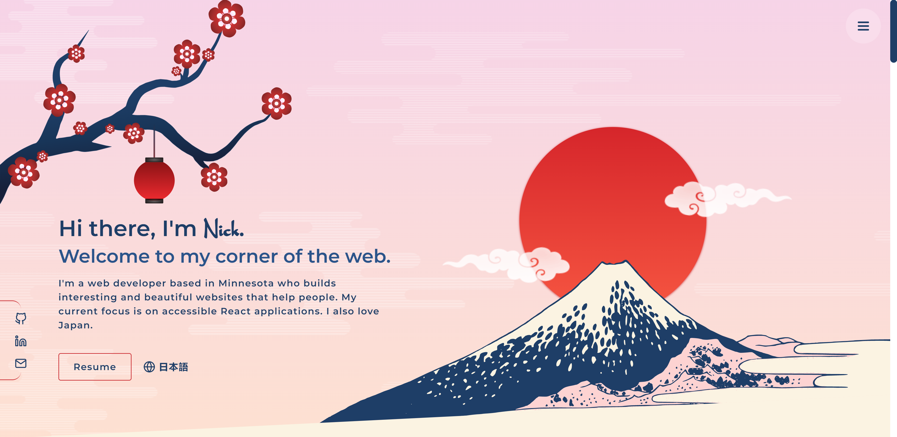
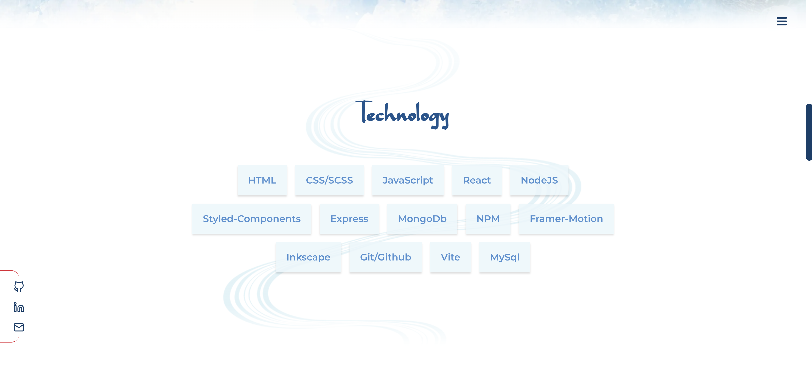
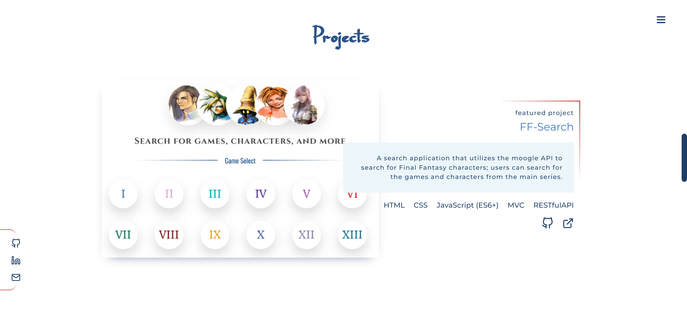
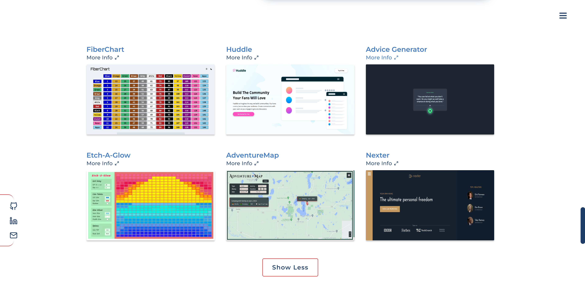
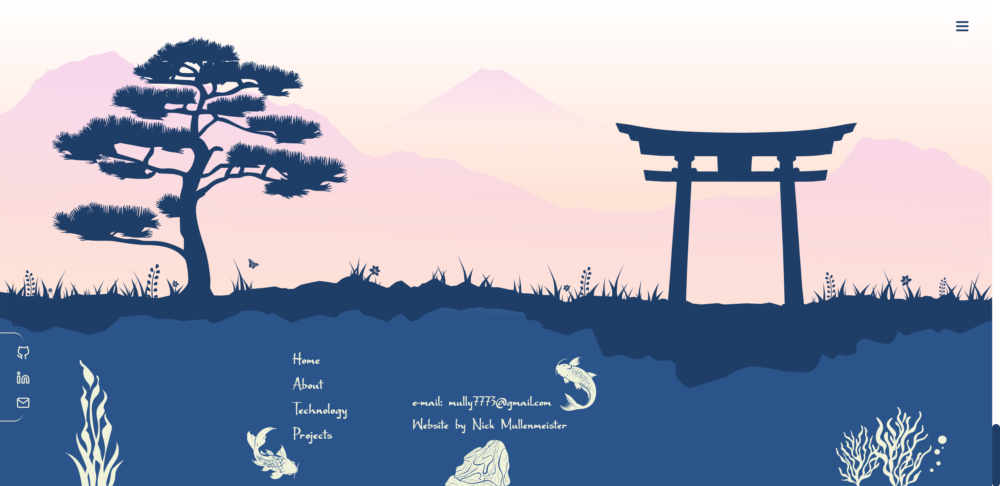

<h1 align='center'>Shin-Portfolio</h1>

  <h3>
    <a href="https://nick-mullenmeister-dev.netlify.app" target="_blank" color="white">
      Live Link
    </a>
  </h3>

   Version 1.0 of my web portfolio. It is Japan-inspired.  You can learn more about me and see my favorite web projects here.

 
 

</img>

 
 

## 💡 Technologies:

   
  

 

- Context API
- useMemo()
- <a href="https://react.i18next.com/" color="white">
      Localization (Japanese) 
    </a>
- ThemeProvider
- Light/Dark Theme
- Local Storage
- Responsive Design
- SVG (created with <a href="https://inkscape.org/" color="white">
  Inkscape
  </a>)
- <a href="https://www.framer.com/motion/" color="white">
      Framer Motion
    </a>

## 📄 Description

Welcome to my web portfolio! I designed and developed this portfolio to showcase my web development projects and to provide a little more information about myself. I wanted to make a Japan-inspired website and felt this portfolio would be a good match. I also added Japanese translations, which was another aspect of web development I wanted to practice. I drew most of the SVGs using Inkscape.
 

## 📷 Screenshots

### About

 
 

### Technology

 
 

### Projects

 
 

### More Projects

 
 

### Footer

 
 

## Questions and Feedback:

Feel free to contact me at mully7773@gmail.com if you have any questions or feedback.  
You can view more of my projects at https://github.com/Mully7773.
# Portfolio1
